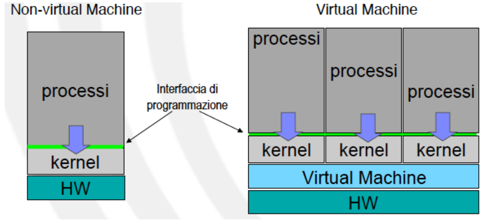
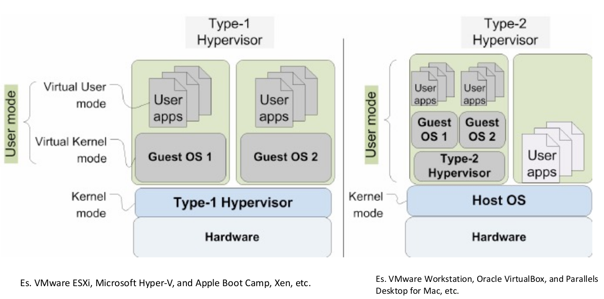
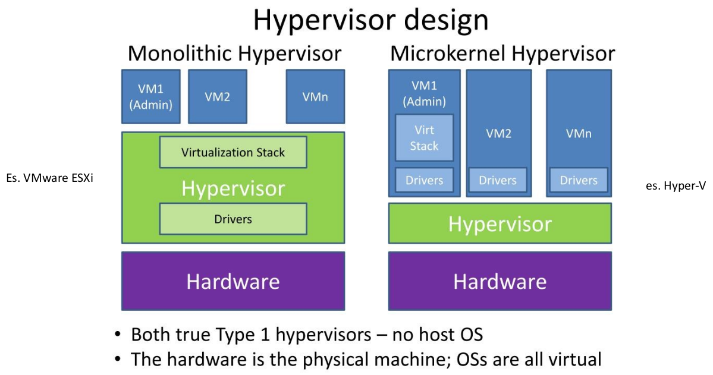
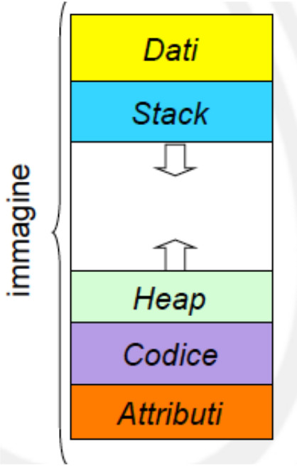

# Lezione 3

## Principi di progettazione

È importante separare:

- **Policy**: Cosa deve essere fatto?
- **Meccanismi**: Come farlo?

La separazione tra policy e meccanismi e molto importante
perché permette la maggior flessibilitá se le policy devono
essere modificate in un secondo tempo.

### KISS

Keep it simple and stupid.

Molto meglio dare la priorità alle performance e non alla compessità.

### POLA

Principle Of the Least Privileges

- Ogni componente deve avere solo i privilegi che sono necessari ad eseguire la sua funzione e nulla più
- Fondamentale per garantire la sicurezza e l'affidabilità di un S.O.

È come impostare un limite di prelievo ad un Bancomat per diminuire il danno in caso di "malfunzionamento".

Pochi S.O. lo implementano, ma deve essere un principio di design.

## Sistemi monolitici

Non c'è gerarchia

- Unico strato tra SW e HW
- Componenti tutti allo stesso livello
- Insieme di procedure che possono chiamarsi vicendevolmente ( NON POLA )

Svantaggi:

- Codice dipendente dall'architettura HW
- Test e debug difficili

## Sistemi a struttura semplice

Minima organizzazione gerarchica

- Definizione dei livelli della gerarchia molto flessibile
- Strutturazione mira a ridurre costi di sviluppo e manutenzione

Es.: MS-DOS, UNIX originale

### MS-DOS

Pensato per fornire maggior numero di funzionalità nel minimo spazio.

- Non suddiviso in moduli
- Possiede un minimo di struttura, ma le interfacce e i livelli di funzionalità non sono ben definiti
- Non prevede dual mode (perché Intel 8088 non lo forniva)

### UNIX (originale)

Struttura base limitata a casua delle limitate funzionalità HW.
Separa:

- Programmi di sistema
  - Customizzabile
- Kernel
  - Intoccabile da parte degli utenti

## Sistema a livelli

Servizi organizzati per livelli ( o anelli concentrici ).

Dal livello più alto (interfaccia utente) al più basso (HW).

Ogni livello:

- può usare solo funzioni fornite dal livello inferiore
- definisce precisamente il tipo di servizio e l'interfaccia verso il livello superiore nascondendone l'implementazione.

Vantaggi:

- Modularità

Svantaggi:

- non è semplice identificare i livelli
- Minor efficienza: ogni strato aggiunge overhead alle system call
  - Un servizio di alto livello deve passare attraverso molte chiamate di livelli intermedi per raggiungere il livello più basso (poco efficiente).
- Minor portabilità: funzionalità dipendenti dall’architettura sono sparse sui vari livelli

Es.: THE, MULTICS, OS/2

### THE (Dijsktra 1968)

Sistema operativo accademico per sistemi batch.

Primo sistema operativo ad implementare i semafori.

## Sistemi basati su kernel

Due soli livelli:

- Servizi kernel
- Servizi non-kernel
  - filesystem, shell, editor, ecc.

Tipico delle implementazioni moderne di UNIX.

Vantaggi:

- Vantaggi dei sistemi a livelli, ma seza averne troppi

Svantaggi:

- Non così generale come i sistemi a livelli
- Nessuna regola organizzativa per le parti del S.O. fuori dal kernel
- Kernel complesso tende a diventare monolitico

### Micro-kernel

Kernel molto piccolo, con solo ciò che è stretamente necessario.

Senza device drivers, senza filesystem, ecc.

Vantaggi:

- Meno errori, perciò più affidabile e sicuro
- Modularità

Svantaggi:

- Performance peggiori
  - Per comunicare con servizi non-kernel, il kernel deve passare attraverso più livelli a differenza di un sistema monolitico che utilizza la memoria condivisa.

## Virtual Machine

Estremizzazione dell'approccio a livelli.

HW e VM trattati come hardware

- Il S.O. esegue sopra la VM
- La VM da l'illusione di processi multipli, ciascuno in esecuzione sul proprio HW.

Da la possibilitá di eseguire più sistemi operativi contemporaneamente.

Utile per testare protocolli di rete sulla stessa macchina simulando molti host.

Svantaggi:

- Performance peggiori

### Type 1 and Type 2 hypervisor

VM = VM monitor (hypervisor) + VM runtime environment

#### Type 1

- L'hypervisor gira sull'HW in kernel mode
- Il sistema operativo gira sopra di esso in virtual kernel mode
- Sopra di esso posso avere più VM in user mode

Più efficiente, più scalabile, ma più costoso.

Permette di isolare completamente le VM l'una dall'altra.

Utile per eseguire sistemi operativi di cui non si conosce la sicurezza.

#### Type 2

- Il sistema operativo dell'host gira in kernel mode
- Sopra di esso gira l'hypervisor in virtual kernel mode
- L'hypervisor esegue le VM in user mode

La separazione fra i sistemi operativi è logica perciò meno sicura.

### Monolithic vs Micro-kernel VM

La micro-kernel VM è più efficiente, ma più complessa da implementare.

## Sistemi client-server

Si basa sul micro-kernel.
Si vedono i servizi come client e server.

Il kernel si occupa solo della gestione della comunicazione tra i client e i server.

Abbastanza pesante, perciò non adatto a sistemi general purpose.

Si presta a bene per S.O. distribuiti.

Ad esempio il fyilesystem è un server che offre servizi di lettura e scrittura.

---

## SELinux

Security Enhanced Linux è un sistema operativo Linux basato su kernel Linux,
che integra un sistema di sicurezza basato su policy.

Per ogni daemon è definita una policy che specifica quali operazioni
può eseguire e quali no.

Reintrodotto con recentemente con Android.

Altrimenti non utilizzato in sistemi general purpose.

## Implementazione dei un S.O.

Tradizionalmente scritti in assembler.

S.O. moderni sono scritti in C/C++.

Vantaggi:

- Implementazione più rapida
- Più compatto
- Più facile da capire e da mantenere
- Portabilità

---
---

## Processi e thread

### Processo e progrmma

Processo = istanza di un programma in esecuzione.

- Programma = conecetto statico
- Processo = concetto dinamico

Un processo viene eseguito in maniera sequenziale ...

Ma in un ambiente multiprogrammato i processi evolvono in maniera concorrente.

Vanno gestite le risorse limitate per i vari procssi in esecuzione.

#### Immagine di memoria

Un processo consiste di:

- Istruzioni ( Parte statica del codice )
- Dati ( Variabili globali, ecc. )
- Stack
  - Chiamate a funzioni e parametri
  - Variabili locali
- Heap
  - Allocazione dinamica di memoria
- Attributi ( Non accessibili dal processo ma dall'S.O. )
  - id
  - stato
  - controllo

##### Attributi

All'interno del S.O. ogni processo è rappresentato dal process control block (PCB) che contiene:

- stato del processo
- program counter
- valori dei registri
- informazioni sulla memoria
- informazioni sullo stato dell'I/O
- informazioni sull'utilizzo della CPU
- informazioni di scheduling
  - es. priorità
