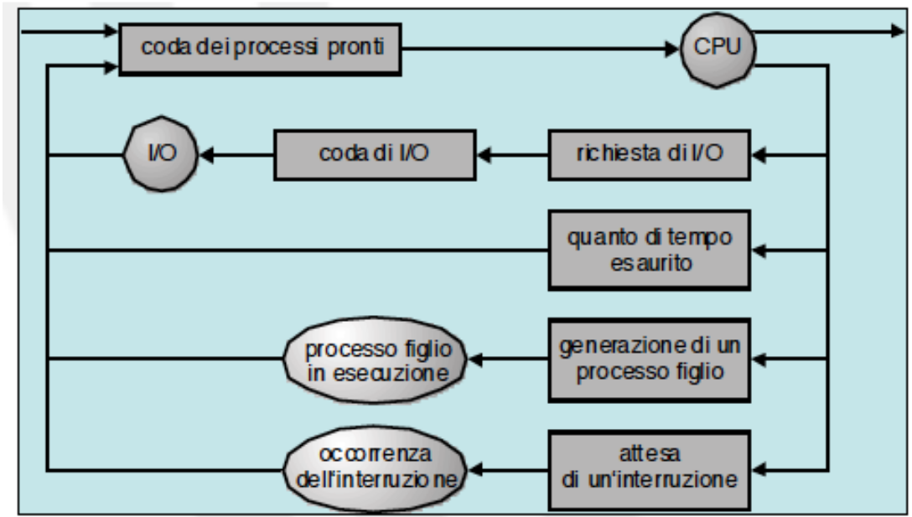

# Lezione 4

## Stati di un processo

Durante l'esecuzione un processo attraversa diversi stati.

Principalmente si trova:

- in esecuzione
- non in esecuzione

Un processo può essere pronto o in attesa.

Quando ci sono tanti processi pronti ( praticamente sempre ) l'S.O. sceglie quale eseguire.

Un processo ha un tempo limite di esecuzione ( timeout ) in modo che un processo non monopolizzi la CPU.

Un processo in stato "Pronto" può passare direttamente in stato "Terminato" se il S.O. decide di non voler piú eseguirlo ( ad esempio se vuole liberare risorse ).

## Scheduling

Selezione del processo da eseguire nella CPU al fine di garantire:

- Multiprogrammazione
  - Massimizzare l'utilizzo della CPU
- Time-sharing
  - Commutare frequntemente la CPU tra i processi in modo che ogni processo abbia l'illusione di avere la CPU tutta per se
  
**Long-term scheduler** (o job scheduler)

- seleziona quali processi devono essere trasferiti nella coda dei processi pronti.

**Short-term scheduler** (o CPU scheduler)

- seleziona quali sono i prossimi processi ad essere eseguiti e alloca la CPU di conseguenza

### Short-term scheduler

Invocato molto frequentemente ( millisecondi ) => deve essere veloce.

### Long-term scheduler

Invocato meno frequentemente ( secondi, minuti ) => può essere lento.

### Code di scheduling

Ogni processo viene inserito in una serie di code di scheduling.

- Coda dei processi pronti ( ready queue )
- Coda di un dispositivo

All’inizio il processo è nella ready queue fino a quando non viene selezionato per essere eseguito (dispatched).

Durante l’esecuzione può succedere che:

- Il processo necessita di I/O e viene inserito in una coda di un dispositivo
- Il processo termina il quanto di tempo, viene rimosso forzatamente dalla CPU e re-inserito nella ready queue
- Il processo crea un figlio e ne attende la terminazione
- Il processo si mette in attesa di un evento

## Operazione di dispatch

1. Cambio di contesto: salvare il PCB del processo che esce e caricare il PCB del processo che entra
2. Passaggio alla modalità utente: all'inizio della fase di dispatch il sistema si trova in modalità kernel
3. Salto all'istruzione da eseguire del processo appena arrivato

### Cambio di contesto

Passaggio della CPU a un altro processo ( costoso ).

## Operazioni sui processi

### Creazione di un processo

Un processo può creare un figlio.

- Il figlio ottiene risorse dall'S.O. o dal padre
- Tipi di eseuzione:
  - Sincrona: il padre attende la terminazione del figlio
  - Asincrona: evoluzione "parallela" ( concorrente ) di padre e figli

### Creazione di un processo ( UNIX )

- System call fork
  - Crea un figlio che è un duplicato esatto del padre
- System call exec
  - Carica sul figlio un programma diverso da quello del padre
- System call wait
  - Per esecuzione sincrona tra padre e figlio

### Terminazione di un processo

- Processo finisce la sua esecuzione
- Processo terminato forzatamente dal padre
  - Per eccesso nell'uso di risorse
  - Il compito del figlio non è piú necessario
  - Il padre termina e il S.O. non permette ai figli di sopravvivere al padre
- Processo terminato forzatamente dal S.O.
  - Utente chiude il programma
  - Errori ( aritmetici, di protezione, di memoria, ecc. )

## Gestione dei processi del S.O.

### Esecuzione del kernel

Il S.O. è un programma a tutti gli effetti.

Il S.O. può essere considerato un processo?

Opzioni:

- Kernel eseguito separatamente
- Kernel eseguito all'interno di un processo utente
- Kernel eseguito come processo

#### Kernel "separato"

Kernel esegue "al di fuori" di ogni processo.

- S.O. possiede uno spazio "riservato" in memoria
- S.O. prende il controllo del sistema
- S.O. sempre in esecuzione in modo privilegiato

Concetto di processo applicato solo a processi utente.

Tipico dei primi sistemi operativi.

Problematiche:

Trattando i processi kernel in maniera diversa le cose vanno implementate due volte e in maniera diversa.

#### Kernel in processi "utente"

Servizi del S.O. = procedure chiamabili da programmi utente.

- Accessibili in modalità protetta ( kernel mode )
- Immagine di processi prevede
  - Kernel stack per gestire il funzionamento di un processo in modalità protetta
  - Codice/dati del S.O. condivisi fra processi

Vantaggi:

- In occasione di interrupt o trap durante l’esecuzione di un processo utente serve solo mode switch
  - Mode switch = il sistema passa da user mode a kernel mode e viene eseguita la parte di codice relativa al S.O. senza context switch
  - Più leggero rispetto al context switch
- Dopo il completamento del suo lavoro, il S.O. può decidere di riattivare lo stesso processo utente (mode switch) o un altro (context switch)

#### Kernel come processo

Servizi del S.O. = processi individuali.

- Eseguiti in modalità protetta
- Una minima parte del S.O. deve comunque esguire al di fuori dello scheduler
- Vantaggioso per sistemi multiprocessore dove processi del S.O. possono essere eseguiti su un processore ad hoc
